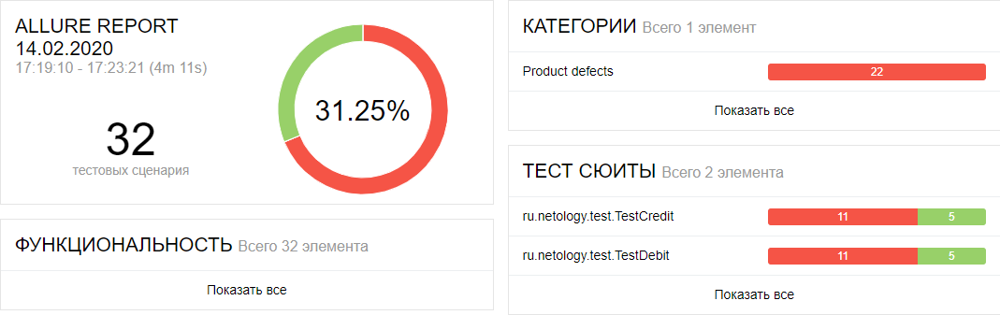

## Отчёт по итогам тестирования

 #### Краткое описание

 Проведена автоматизация тестирования банковского сервиса покупки тура.
 Использованы следующие основные инструменты автоматизации:
 *  Java 8 - наиболее распространенная версия в настоящее время
 *  Junit 5 - позволяет создавать автоматизированные тесты на java
 *  Selenide - для автоматизации UI тестов на java c простым синтаксисом
 *  Faker - как генератор случайных имён владельца карты
 *  Allure - генератор отчётов тестирования

 #### Вспомогательные инструменты в docker-контейнерах:
 *  MySQL - база данных с которой может работать приложение
 *  PostgreSQL - вторая база данных с которой может работать приложение
 *  node-js - окружение в котором работает симулятор банкоского сервиса

 #### Количество тест-кейсов
 Создано 32 тест-кейса:
 *  Пройдено успешно: 10
 *  Тестов не пройдено: 22

 

 #### Общие рекомендации
 1.	Необходима спецификация на продукт, т.к.:
 *  Отсутствие чётких требований может привести тестровщиков с малым опытом работы к ошибкам, в тестах будут заложены предполагаемые, но неверные значения (например: действительно ли карта не может иметь срок действия более 5 лет).
 *  Отсутствует информация по правильному заполнению таблиц в базах данных.
 *  Нет информации по API.
 2.	Сообщения о необходимости заполнения полей формы привести к единому формату.
 3.	Сообщения об успехе и отказе в оплате сделать разных цветов.